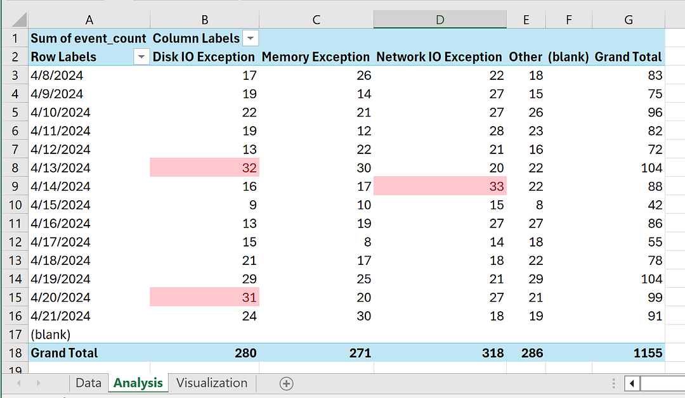
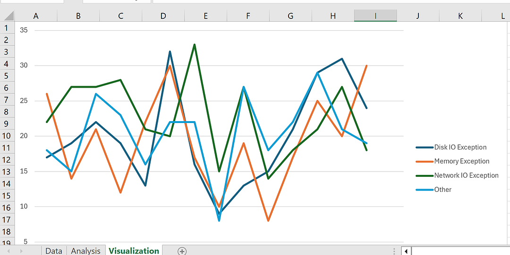
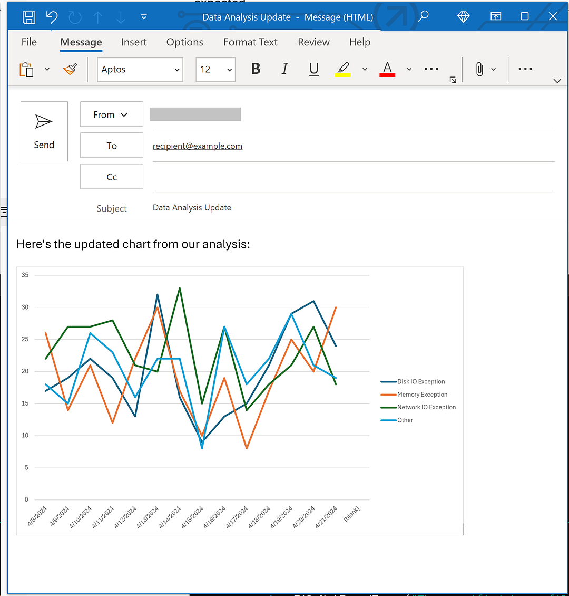
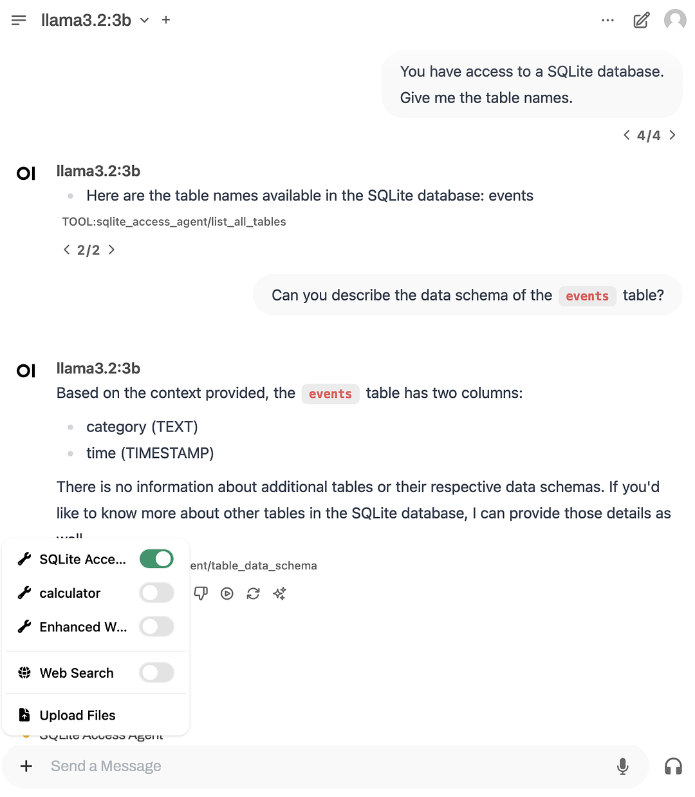
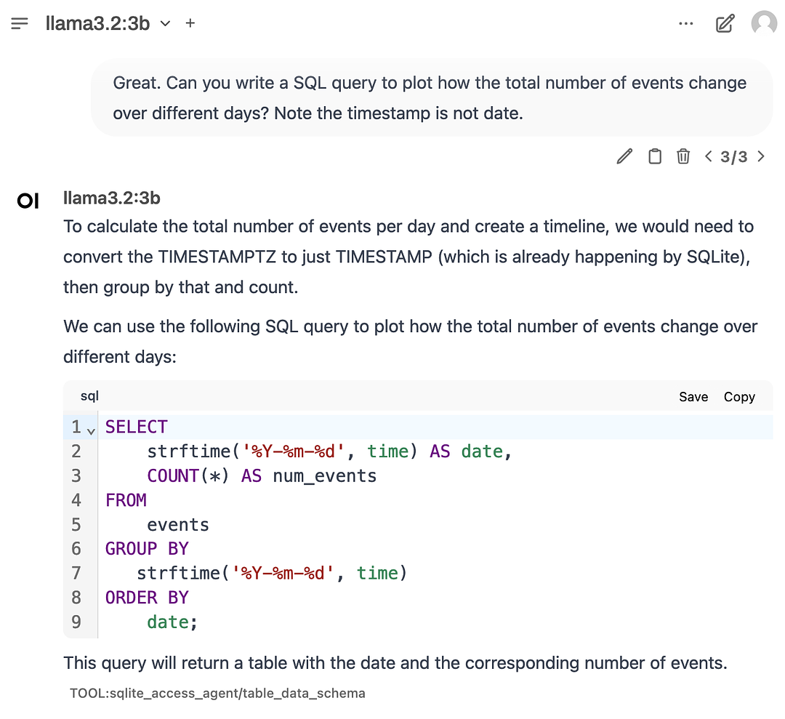
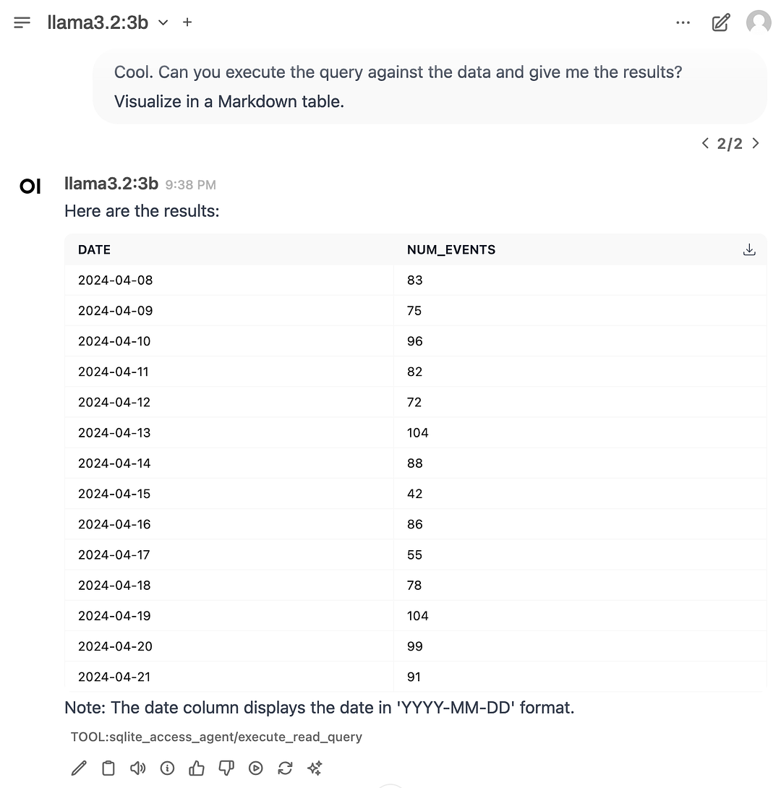
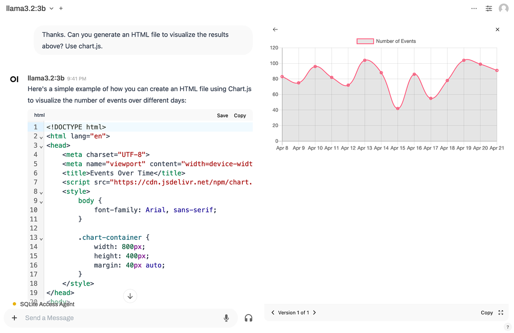
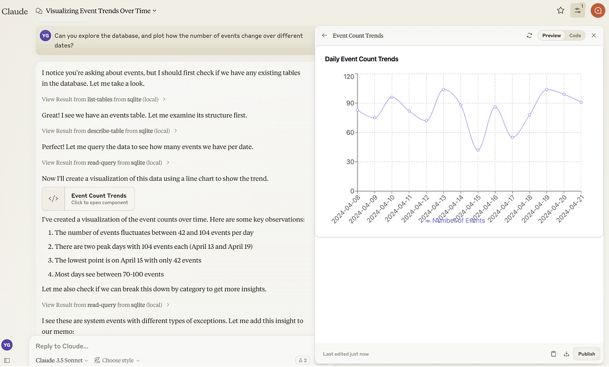

# GenAI Case Study: Automated Weekly Business Review

## Overview

This case study demonstrates how to automate the Weekly Business Review (WBR) process using Generative AI. WBR is a common practice in many companies where core business metrics are reviewed each week. This automation allows analysts to focus on generating insights rather than spending time on repetitive data collection and presentation tasks.

## Problem Statement

### Current Workflow

A typical WBR workflow consists of three stages:

1. **Data Collection**: Analysts run pre-written queries on databases and manually copy-paste results into Excel

   

2. **Data Analysis**: Excel templates automatically update with pivot tables and visualizations when data is refreshed

   

3. **Data Presentation**: Analysts write emails with key findings and attach Excel files

### Pain Points

- **Manual and time-consuming data collection**: Requires logging into SQL databases, running queries, waiting for completion, and copy-pasting results
- **Repetitive data presentation**: Email creation involves manual copy-pasting of charts from Excel
- **Lack of insights**: Time spent on repetitive work leaves little room for exploring patterns and deriving actionable insights

## Solution: AI-Powered Automation

### Approach

We use Generative AI (ChatGPT/GPT-4) to automate the entire workflow:

1. **Automated SQL Query Execution**: Python scripts connect to databases and execute queries automatically
2. **Automated Excel Updates**: Results are automatically inserted into Excel templates
3. **Automated Email Generation**: Charts are extracted and emails are drafted programmatically

### Key Benefits

- Reduces manual workflow from multiple steps to a single program execution
- Frees analyst time for creative, high-value work
- Enables focus on insights rather than data manipulation
- Significantly faster than manual processes (5-10 minutes vs. hours)

## Repository Structure

```
GenAI-Casestudy-automated-WeeklyBusinessReview/
├── README.md                 # This file
├── requirements.txt          # Python dependencies
├── images/                   # Images and screenshots
│   ├── image1.png          # Excel Data tab screenshot
│   ├── image2.png          # Excel Analysis tab screenshot
│   ├── image3.png          # SQLite agent configuration
│   ├── image4.png          # Data visualization
│   ├── image5.png          # SQL query execution
│   ├── image6.png          # Generated email draft
│   ├── image7.png          # Claude multi-round thinking
│   └── image8.png          # HTML visualization output
├── data/                     # Data files
│   ├── ecommerce_data.db    # SQLite database with ecommerce metrics
│   └── WBR_Working_Sheet.xlsx # Excel template
├── scripts/                  # Automation scripts
│   ├── extract_data.py      # SQL query execution and Excel update
│   ├── generate_email.py    # Email generation with charts
│   └── wbr_automation.py    # Complete end-to-end automation
└── docs/                     # Documentation
    └── implementation_guide.md
```

## Data Sources

### Database: `ecommerce_data.db`

SQLite database containing the following tables:
- `daily_metrics`: Daily business metrics (visitors, purchases, revenue)
- `channels`: Marketing channel information
- `customer_types`: Customer segmentation data
- `product_categories`: Product category information
- `dates`: Date dimension table

### Excel Template: `WBR_Working_Sheet.xlsx`

Excel workbook with three tabs:
- **Data**: Raw data tab that gets updated with query results
- **Analysis**: Contains pivot tables that auto-refresh when Data tab updates
- **Visualization**: Contains charts that visualize the metrics

## Implementation Steps

### Step 1: Identify Pain Points

Before automating, identify specific pain points in your workflow:
- What tasks are repetitive?
- What takes the most time?
- Where can automation add the most value?

### Step 2: Opportunity Sizing

Assess feasibility using GenAI:
- Ask ChatGPT if the automation tasks are feasible
- Evaluate complexity and time investment
- Determine if GenAI can effectively address the pain points

### Step 3: Automate as Much as Possible

Transform the workflow into a single automated process:
- Run the program → Get email draft ready to edit
- Program handles: SQL execution, Excel updates, chart extraction, email drafting

### Step 4: Implementation

#### 4.1 SQL Execution and Excel Update

The script connects to SQLite, executes queries, and updates Excel:

```python
# See scripts/extract_data.py for full implementation
```

#### 4.2 Email Generation

The script refreshes pivot tables, extracts charts, and creates email drafts:

```python
# See scripts/generate_email.py for full implementation
```



## Key Learnings

### Context Window Management

- Break down complex problems into smaller subproblems
- Use editing style prompts for iterative refinement
- Manage context window intentionally to maintain focus

### Prompt Engineering Principles

1. **Be specific**: Provide clear instructions and file paths
2. **Use examples**: Show expected input/output formats
3. **Iterate**: Don't expect perfect code on first try
4. **Debug systematically**: Paste errors back to AI for fixes

### Common Challenges

- **Path handling**: Use absolute paths for Windows COM objects (win32com)
- **Library compatibility**: Some libraries may have version-specific APIs
- **Error handling**: Expect multiple iterations for complex tasks

## Advanced: Using AI Agents

### Method 1: Agents with Tool Access

Using Open WebUI with Llama 3.2 3B and SQLite agent:
- AI can autonomously explore databases
- Write and execute SQL queries
- Generate visualizations
- All data stays local









### Method 2: Multi-Round Thinking with MCP

Using Claude Desktop with Model Context Protocol:
- AI makes multi-step decisions autonomously
- Iterates until goals are achieved
- Uses standardized agent interfaces



## Usage

### Prerequisites

```bash
pip install -r requirements.txt
```

### Running the Automation

```bash
# Extract data and update Excel
python scripts/extract_data.py

# Generate email with charts
python scripts/generate_email.py

# Run complete automation
python scripts/wbr_automation.py
```

## Results

After automation:
- **Time saved**: 80-90% reduction in manual work
- **Quality improvement**: More consistent reports
- **Focus shift**: Analysts can focus on insights and analysis
- **Scalability**: Easy to adapt for different time periods or metrics

## Reflection

### Key Takeaways

1. **Builder's Mindset**: Treat AI as a tool to automate repetitive tasks
2. **Automation Habit**: Build habits to automate routine work
3. **Focus on Value**: Save attention for creative, high-impact tasks
4. **Iterative Approach**: Start simple, refine based on results

### Future Enhancements

- Integration with cloud databases (SQL Server, PostgreSQL)
- Support for Google Sheets instead of Excel
- Automated insight generation using LLMs
- Dashboard integration (Tableau, Power BI)
- Scheduled automation (weekly runs)

## References

- [Open WebUI SQLite Agent](https://openwebui.com/t/grapeot/yage_sqlite)
- [Model Context Protocol](https://modelcontextprotocol.io)
- [Claude Computer Use](https://docs.anthropic.com/en/docs/build-with-claude/computer-use)

## License

This case study is provided for educational purposes.

## Author

Created as part of GenAI case study series demonstrating practical automation workflows.
